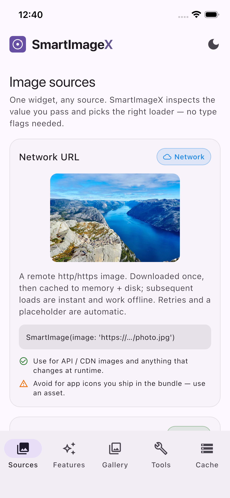
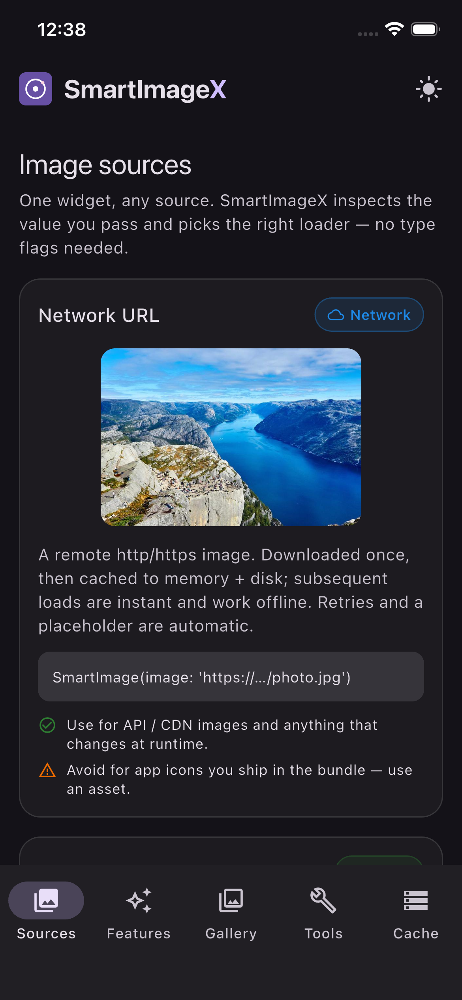
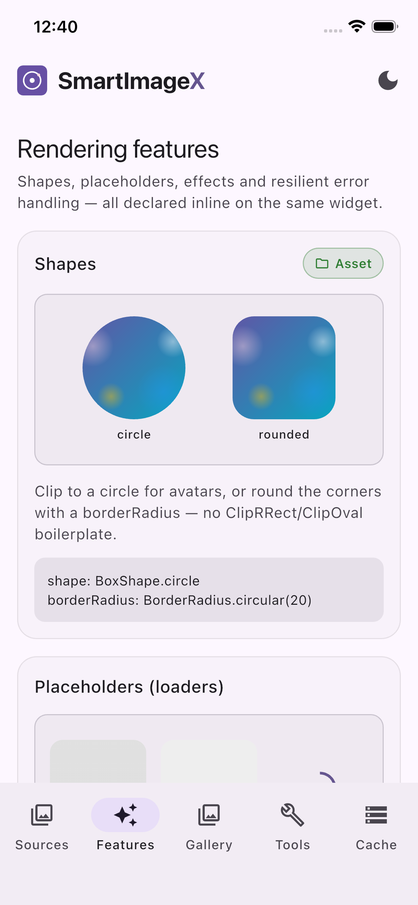
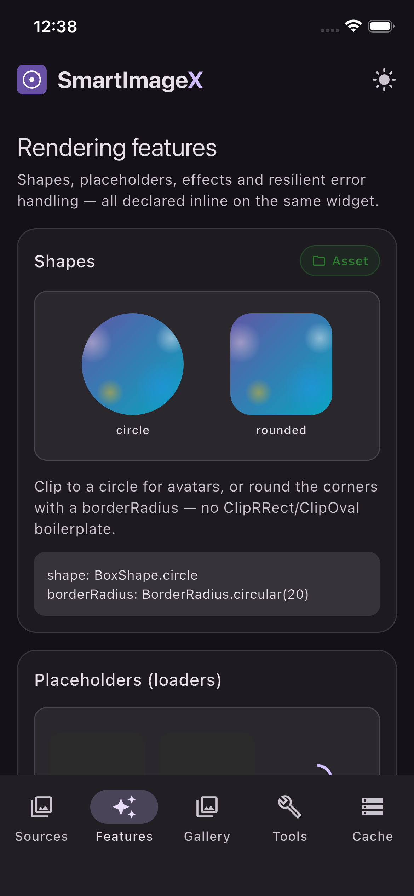
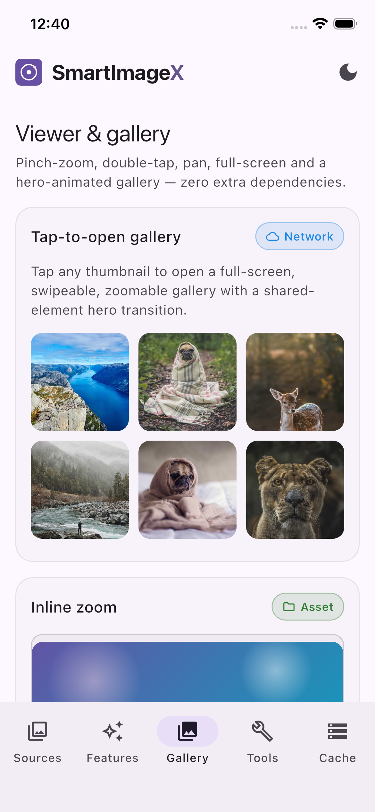
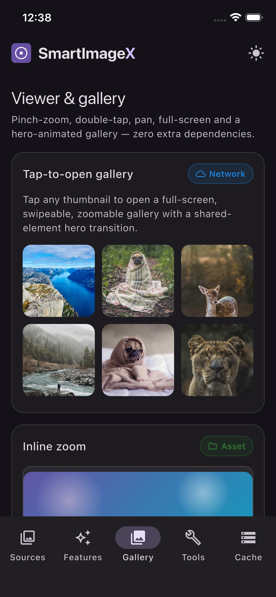
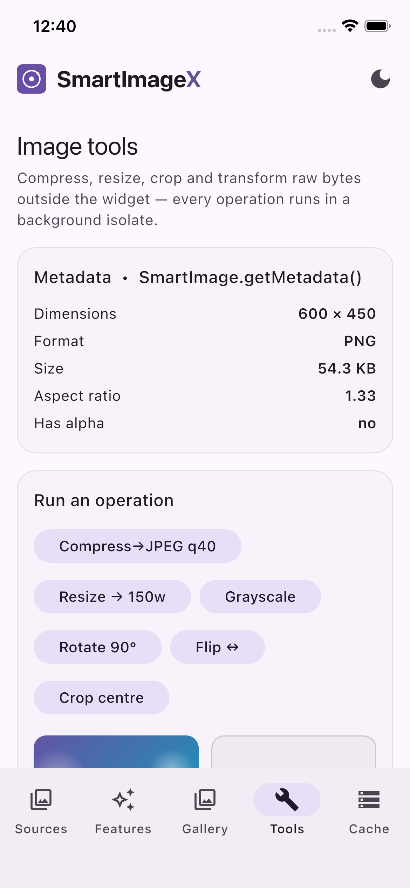
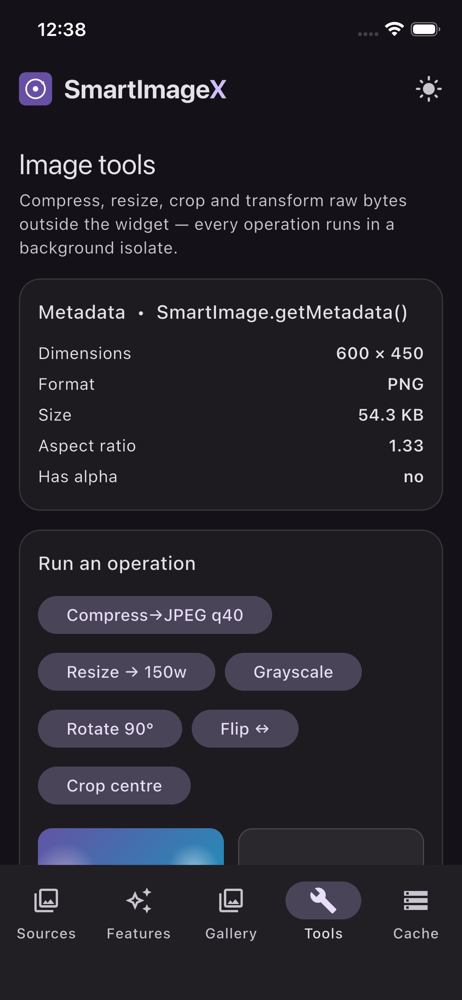
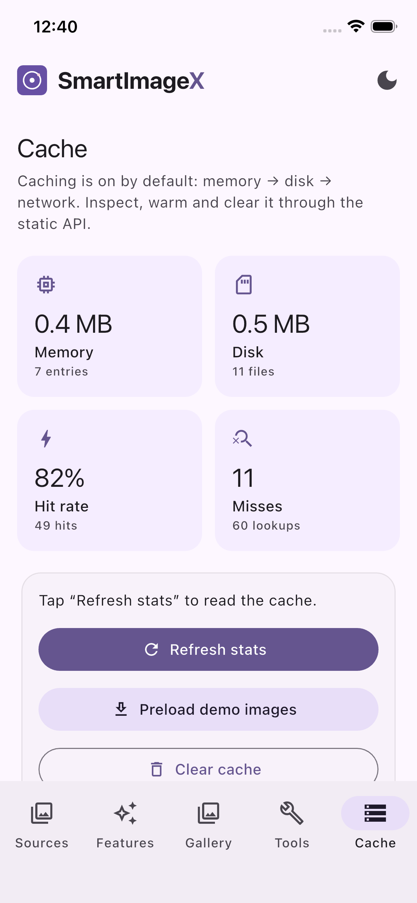
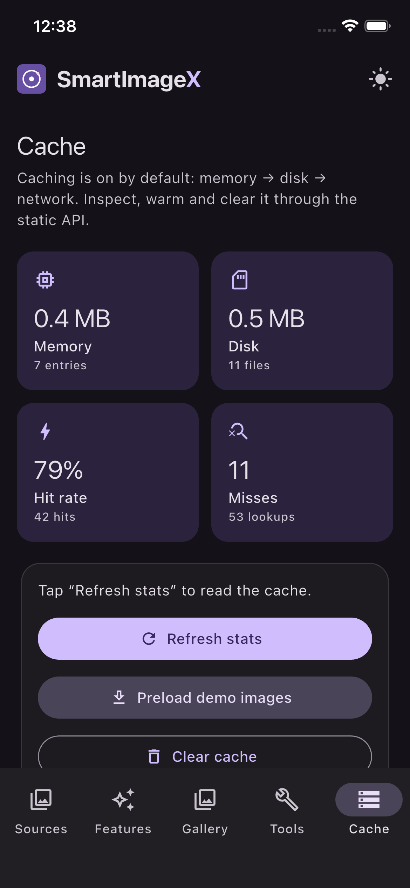

<div align="center">

# SmartImageX

### One image widget for everything.

[](https://pub.dev)
[](LICENSE)
[](https://pub.dev/packages/flutter_lints)
[](#testing)
[](#testing)

</div>

SmartImageX replaces a whole stack of single-purpose image packages with **one
widget** that figures everything out for you — the source, the format, caching,
retries, fallbacks, placeholders, zoom, galleries and more.

```dart
SmartImage(image: anything)
```

That's the entire API for the common case. `anything` can be a **network URL**,
an **asset path**, a **file path**, a **`Uint8List`**, a **base64 string**, a
**`data:` URI** or **inline SVG markup**. SmartImageX detects what it is, picks
the right renderer, caches it, and shows a placeholder while it loads — with
**zero configuration**.

---

## Screenshots

> Captured from the bundled [example app](example/) — light and dark modes.
> (Add your own images to [`screenshots/`](screenshots/README.md); they appear
> here automatically.)

| | Light | Dark |
| --- | --- | --- |
| **Sources** |  |  |
| **Features** |  |  |
| **Gallery** |  |  |
| **Tools** |  |  |
| **Cache** |  |  |

---

## Table of contents

- [Why SmartImageX](#why-smartimagex)
- [Installation](#installation)
- [Quick start](#quick-start)
- [Supported sources](#supported-sources) · [How detection works](#how-auto-detection-works)
- [Supported formats](#supported-formats)
- [The full API](#the-full-api)
- [Caching](#caching)
- [Loaders, errors & fallbacks](#loaders-errors--fallbacks)
- [Effects & transforms](#effects--transforms)
- [Zoom, viewer & gallery](#zoom-viewer--gallery)
- [Progressive loading & BlurHash](#progressive-loading--blurhash)
- [Image utilities](#image-utilities)
- [Lifecycle callbacks](#lifecycle-callbacks)
- [Global configuration](#global-configuration)
- [Static API reference](#static-api-reference)
- [Performance guide](#performance-guide)
- [Troubleshooting & gotchas](#troubleshooting--gotchas)
- [FAQ](#faq)
- [Architecture](#architecture)
- [Migration guide](#migration-guide)
- [Testing](#testing)
- [Contributing](#contributing)

---

## Why SmartImageX

A typical app pulls in several packages to handle images —
`cached_network_image`, `flutter_svg`, `photo_view`, `shimmer`,
`flutter_blurhash`, `flutter_image_compress` — plus glue code to wire them
together. SmartImageX collapses all of that into a single, cohesive widget.

| You used to need…            | Now you write…                              |
| ---------------------------- | ------------------------------------------- |
| `cached_network_image`       | `SmartImage(image: url)`                    |
| `flutter_svg`                | `SmartImage(image: url)` *(auto-SVG)*       |
| `photo_view` / lightbox      | `SmartImage(image: url, enableZoom: true)`  |
| `shimmer` placeholders       | built-in (`LoaderType.shimmer`)             |
| `flutter_blurhash`           | `SmartImage(image: url, blurHash: h)`       |
| `flutter_image_compress`     | `SmartImageTools.compressImage(bytes)`      |
| a gallery/lightbox viewer    | `SmartImageGallery(images: [...])`          |

## Installation

```yaml
dependencies:
  smart_image_x: ^1.0.0
```

```bash
flutter pub get
```

```dart
import 'package:smart_image_x/smart_image_x.dart';
```

> **Platforms:** Android · iOS · macOS · Windows · Linux · Web. The disk cache
> uses the platform temp directory; on Web it degrades gracefully to
> memory-only (everything else works unchanged).

## Quick start

```dart
// Network — cached, retried, shimmer placeholder, all automatic.
SmartImage(image: 'https://example.com/photo.jpg')

// Asset — detected from the path (must be declared in pubspec.yaml).
SmartImage(image: 'assets/logo.png')

// SVG — detected from the .svg extension or the markup itself.
SmartImage(image: 'assets/icon.svg')

// Bytes / base64 / data URI — all just work.
SmartImage(image: myUint8List)
SmartImage(image: 'data:image/png;base64,iVBORw0...')
```

## Supported sources

Every source below is **auto-detected** — you never pass a type flag. The
example app's **Sources** tab shows each one live.

| Source | What it is | Example value | ✅ Use when | ⚠️ Avoid when |
| --- | --- | --- | --- | --- |
| **Network** | `http`/`https` URL | `https://cdn/x.jpg` | API/CDN images, anything dynamic | Bundled icons → use an asset |
| **Asset (raster)** | PNG/JPG/WebP/GIF in the bundle | `assets/x.png` | Images you ship with the app | User/remote images |
| **Asset (SVG)** | `.svg` in the bundle | `assets/icon.svg` | Scalable icons/illustrations | Photos (use raster) |
| **Inline SVG** | raw `<svg>…</svg>` text | `'<svg>…</svg>'` | SVG from a backend / generated | Huge SVGs you could ship as assets |
| **Memory** | `Uint8List` / `List<int>` | `myBytes` | Bytes you already hold (camera, DB) | Re-encoding the same bytes repeatedly |
| **Base64** | bare base64 or `data:` URI | `'data:image/png;base64,…'` | Small images embedded in JSON/HTML | Large images (~33% bigger than binary) |
| **File** | absolute filesystem path | `/storage/x.jpg`, `C:\x.png` | Picked photos, downloads, cached docs | Bundled images → use an asset |

> **Assets must be declared in `pubspec.yaml`** under `flutter: assets:` — this
> is a Flutter requirement, not specific to SmartImageX.

### How auto-detection works

Detection is **heuristic and ordered most-specific-first**, so ambiguous strings
resolve predictably:

1. Runtime type wins first: `Uint8List`/`List<int>` → memory, `Uri` → parsed.
2. For strings: inline SVG (`<svg`) → `data:` URI → `http(s)://` → `file://`
   → asset paths (`assets/…`, `packages/…`) → filesystem paths
   (`/…`, `./…`, `C:\…`) → bare base64 → finally a relative path with an image
   extension is treated as an asset.

**Forcing a type when a string is ambiguous:** pass a typed value instead of a
string — e.g. `Uri.file(path)` for a file, or the decoded `Uint8List` for bytes.

The **format** (PNG/JPEG/WebP/GIF/SVG/AVIF/BMP) is detected separately, from the
file's **magic bytes** first (authoritative, independent of extension/MIME),
then MIME, then extension.

## Supported formats

PNG · JPEG · WebP · GIF · SVG · AVIF\* · BMP — chosen automatically.

\* AVIF rendering depends on the host platform's codec support.

## The full API

Everything is optional and overridable on the widget:

```dart
SmartImage(
  image: imageUrl,

  // Layout
  width: 120,
  height: 120,
  fit: BoxFit.cover,
  alignment: Alignment.center,

  // Shape
  shape: BoxShape.circle,              // or a borderRadius for rounded corners
  borderRadius: BorderRadius.circular(12),

  // Placeholders & errors
  loaderType: LoaderType.shimmer,      // circular | shimmer | skeleton | custom
  loadingBuilder: (context) => const MyLoader(),
  errorBuilder: (context, error) => MyError(error),

  // Fallback chain: fallbackImage → fallbackIcon → errorBuilder → default
  fallbackImage: 'assets/default_user.png',
  fallbackIcon: Icons.person,

  // Resilience
  retryCount: 3,
  retryDelay: const Duration(seconds: 1),

  // Interaction
  enableZoom: true,                    // inline pinch/double-tap zoom
  openViewerOnTap: true,               // or open a full-screen viewer on tap
  heroTag: 'profile',

  // Perception
  blurHash: blurHashString,            // instant placeholder
  thumbnail: thumbUrl,                 // progressive (low-res first)
  transition: TransitionType.fade,     // none | fade | crossFade | scale
  transitionDuration: const Duration(milliseconds: 300),

  // Performance & policy
  adaptiveQuality: true,               // smaller decode on slow links
  cachePolicy: CachePolicy.smart,      // smart | memoryOnly | diskOnly | refresh | none
  priority: ImagePriority.high,        // low | normal | high | critical

  // Effects (processed off the UI thread)
  grayscale: true,
  blur: 4,
  brightness: 0.1,
  contrast: 110,
  saturation: 1.2,

  // Accessibility & security
  semanticLabel: 'User profile photo',
  excludeFromSemantics: false,
  allowedDomains: ['cdn.example.com'],

  // Lifecycle callbacks
  onLoadStart: () {},
  onLoadSuccess: () {},
  onLoadError: (error) {},
  onRetry: (attempt, error) {},
  onFallback: () {},
  onCacheHit: () {},
  onCacheMiss: () {},
  onProgress: (p) => print('${p.percent}%'),
)
```

## Caching

Caching is **on by default** with a two-tier flow that also works offline:

```
request → memory (LRU) → disk (TTL + size bounded) → network → write back
```

Disk entries are **gzipped only when it actually shrinks them** — a real win for
SVG/text, a no-op for already-compressed photos.

Pick a policy per widget:

```dart
SmartImage(image: url, cachePolicy: CachePolicy.smart)      // default
SmartImage(image: url, cachePolicy: CachePolicy.memoryOnly) // no disk
SmartImage(image: url, cachePolicy: CachePolicy.diskOnly)   // survive restart, not in RAM
SmartImage(image: url, cachePolicy: CachePolicy.refresh)    // bust + repopulate
SmartImage(image: url, cachePolicy: CachePolicy.none)       // bypass entirely
```

Manage and inspect it through the static API:

```dart
await SmartImage.preload(url);
await SmartImage.preloadAll([url1, url2, url3]);

final stats = await SmartImage.cacheStats();
print('hit rate: ${(stats.hitRate * 100).toStringAsFixed(1)}%');
print('disk: ${stats.diskCacheSizeMb.toStringAsFixed(1)} MB');

SmartImage.clearMemoryCache();
await SmartImage.clearDiskCache();
await SmartImage.clearCache();      // both tiers
await SmartImage.cleanupCache();    // prune expired disk entries
```

## Loaders, errors & fallbacks

Placeholder styles: `LoaderType.circular` (becomes determinate when download
progress is known), `LoaderType.shimmer`, `LoaderType.skeleton`, or a custom
`loadingBuilder`.

On failure SmartImageX walks a **fallback chain**:

```
primary → fallbackImage → fallbackIcon → errorBuilder → default error UI
```

The default error UI is theme-aware and offers a manual **Retry** button. The
`fallbackImage` itself flows through the full pipeline, so it can be any source
type (asset, network, …).

## Effects & transforms

`grayscale`, `blur`, `brightness`, `contrast` and `saturation` are applied in a
**background isolate**, so they never jank scrolling:

```dart
SmartImage(image: url, grayscale: true)
SmartImage(image: url, blur: 6, saturation: 1.3)
```

> They do re-encode the image, so for *static* assets prefer pre-processing at
> build time. For dynamic/network images, inline effects are the easy win.

## Zoom, viewer & gallery

```dart
// Inline zoom (pinch, double-tap, pan) — no extra package.
SmartImage(image: url, enableZoom: true)

// Tap to open a full-screen, zoomable viewer with a hero transition.
SmartImage(image: url, openViewerOnTap: true, heroTag: 'hero')

// A swipeable, zoomable, hero-animated gallery.
SmartImageGallery(images: photoUrls, initialIndex: 2)

// …or open it as a route on demand.
SmartImageGallery.open(context, images: photoUrls, initialIndex: index);
```

## Progressive loading & BlurHash

```dart
// Show a tiny thumbnail first, then swap in the full image.
SmartImage(image: fullUrl, thumbnail: thumbUrl)

// Show a BlurHash placeholder instantly (decoded natively — no dependency).
SmartImage(image: fullUrl, blurHash: 'L6PZfSi_.AyE_3t7t7R**0o#DgR4')
```

## Image utilities

Standalone, isolate-backed helpers for one-off processing:

```dart
final jpeg   = await SmartImageTools.compressImage(bytes, quality: 70);
final thumb  = await SmartImageTools.resizeImage(bytes, width: 200);
final cut    = await SmartImageTools.cropImage(bytes, x: 0, y: 0, width: 100, height: 100);
final png    = await SmartImageTools.convertFormat(bytes, CompressionFormat.png);
final turned = await SmartImageTools.rotateImage(bytes, 90);
final mirror = await SmartImageTools.flipImage(bytes);

final meta = await SmartImage.getMetadata(bytes); // width, height, format, EXIF…
```

## Lifecycle callbacks

`onLoadStart`, `onLoadSuccess`, `onLoadError`, `onRetry`, `onFallback`,
`onCacheHit`, `onCacheMiss`, `onProgress` — wire any subset you need. `onProgress`
delivers a `DownloadProgress` with `.percent` (0–100) and `.fraction`.

## Global configuration

Set process-wide defaults once at startup (all optional):

```dart
void main() {
  SmartImageConfig.configure(
    const SmartImageConfig(
      cache: CacheConfig(
        maxMemoryBytes: 64 * 1024 * 1024,
        maxDiskBytes: 256 * 1024 * 1024,
        diskEntryTtl: Duration(days: 7),
        compressDiskEntries: true,
      ),
      defaultRetry: RetryConfig(maxAttempts: 4),
      defaultLoaderType: LoaderType.shimmer,
      defaultTransition: TransitionType.fade,
      maxConcurrentDownloads: 6,
      allowedDomains: ['cdn.example.com'],      // null = allow all
      logLevel: SmartImageLogLevel.warning,
    ),
  );
  runApp(const MyApp());
}
```

## Static API reference

| Method | Description |
| --- | --- |
| `SmartImage.clearCache()` | Clear memory **and** disk tiers. |
| `SmartImage.clearMemoryCache()` | Clear the in-memory tier. |
| `SmartImage.clearDiskCache()` | Clear the on-disk tier. |
| `SmartImage.cleanupCache()` | Prune expired disk entries. |
| `SmartImage.cacheStats()` | Return a `CacheStats` snapshot. |
| `SmartImage.preload(image)` | Warm the cache for one source. |
| `SmartImage.preloadAll([...])` | Warm the cache for many sources. |
| `SmartImage.getMetadata(image)` | Read `ImageMetadata` (size, format, EXIF). |

## Performance guide

- **Use it in lists.** Each `SmartImage` resolves lazily and shares the global
  cache. Combine with `adaptiveQuality` to bound decode memory on slow links.
- **Set explicit `width`/`height`.** Lets the decoder downscale and keeps layout
  stable.
- **Pick the cheapest placeholder for long lists.** `LoaderType.skeleton` is a
  single static paint; `shimmer` animates and costs a little more.
- **Preload above-the-fold imagery** with `preloadAll(...)` and a high
  `priority`.
- **Effects re-encode** — prefer build-time processing for static assets.
- **Tune the cache** to your working set via `CacheConfig`.

## Troubleshooting & gotchas

**Asset image doesn't show / "unable to load asset".**
The asset must be declared in `pubspec.yaml` under `flutter: assets:`, and the
path must match exactly (case-sensitive). Run `flutter pub get` after editing.

**A string I expected to be a *file* is treated as an *asset* (or vice-versa).**
Bare relative paths with an image extension default to *asset*. For a real file
path, pass an absolute path or `Uri.file(path)`.

**Network image shows the error/fallback in tests.**
Flutter's test harness blocks real HTTP (returns 400). Inject a fake client or
test against `Uint8List`/asset sources. (SmartImageX's own tests do this.)

**WebP won't *encode*.** The pure-Dart codec can **decode** WebP but cannot
encode it — `CompressionFormat.webp` throws a clear error by design. Use
`CompressionFormat.jpg` or `.png` to encode.

**AVIF doesn't render on some platforms.** AVIF depends on the host platform's
codec; it's recognised but rendering isn't guaranteed everywhere.

**On Web, disk caching seems to do nothing.** Correct — there's no filesystem,
so the disk tier is a no-op and only the in-memory tier is used. Everything else
works.

**`adaptiveQuality` didn't fetch a smaller file.** It reduces *decode
resolution* (memory/CPU) on slow links rather than fetching a different URL — use
`thumbnail:` for an explicit low-res-first source.

**A blocked-domain error appears.** You set `allowedDomains` (globally or on the
widget) and the host isn't whitelisted. Add the host, or set it to `null` to
allow all.

**Effects feel slow on huge images.** They decode + re-encode in an isolate.
Downscale first (`resizeImage`) or pre-process static assets at build time.

## FAQ

**Do I need `flutter_svg`, `cached_network_image`, etc. separately?**
No. SmartImageX bundles what it needs internally; you import one package.

**Does it cache automatically?** Yes — `CachePolicy.smart` by default (memory +
disk). Use `CachePolicy.none` to opt out per widget.

**Is BlurHash a dependency?** No — the decoder is implemented natively in the
package.

**Can the gallery/zoom work without `photo_view`?** Yes — they're built on
Flutter's own `InteractiveViewer`.

**How do I force a reload (cache-bust)?** Use `cachePolicy: CachePolicy.refresh`.

**Where do downloads cache to?** The platform temp directory, under a
`smart_image_x/` subfolder (configurable via `CacheConfig.subDirectory`).

## Architecture

SmartImageX is a layered, SOLID pipeline. Full design, diagrams and rationale
are in [`doc/ARCHITECTURE.md`](doc/ARCHITECTURE.md). In brief:

```
Source Detector → Format Detector → Loader (Cache → Network → Retry)
  → Transform → Renderer (raster | vector) → SmartImage widget
```

## Migration guide

**From `cached_network_image`:**

```dart
// Before
CachedNetworkImage(imageUrl: url, placeholder: (c, _) => Spinner());
// After
SmartImage(image: url, loadingBuilder: (c) => const Spinner());
```

**From `flutter_svg`:** drop the explicit `SvgPicture` — `SmartImage(image: …)`
auto-detects SVG.

**From `photo_view`:** use `SmartImage(image: url, enableZoom: true)` or
`SmartImageGallery`.

**From `flutter_blurhash`:** pass the hash to `SmartImage(blurHash: …)`.

## Testing

```bash
flutter test            # 197 tests
flutter test --coverage # ~90% line coverage
```

The package ships unit and widget tests covering source/format detection, the
cache (memory + disk, including compression), the network and retry engines,
BlurHash decoding, the image utilities, and the widget state machine.

## Contributing

Issues and PRs are welcome. Please run `flutter analyze` and `flutter test`
before submitting — both must be clean.

## License

MIT — see [LICENSE](LICENSE).
